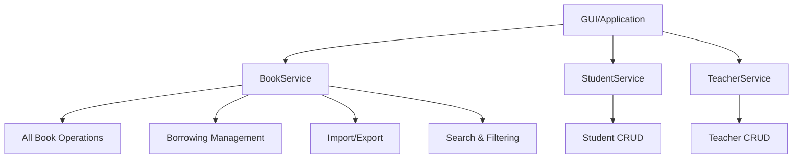
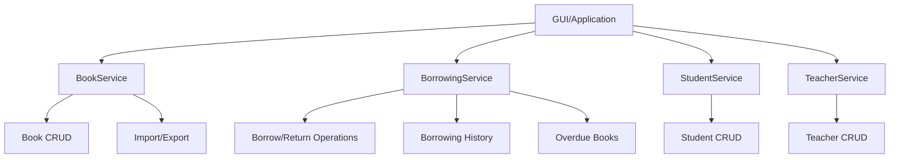

# Book Service Improvements Analysis

## Table of Contents
- [Current State Analysis](#current-state-analysis)
- [Key Issues Identified](#key-issues-identified)
- [Recommended Improvements](#recommended-improvements)
  - [1. Centralize Borrowed Book Functionality](#1-centralize-borrowed-book-functionality)
  - [2. New Services to Add to BookService](#2-new-services-to-add-to-bookservice)
  - [3. Remove Duplicate Methods](#3-remove-duplicate-methods)
  - [4. Architecture Recommendation](#4-architecture-recommendation)
  - [5. Model Enhancements](#5-model-enhancements)
  - [6. Repository Enhancements](#6-repository-enhancements)
- [Implementation Plan](#implementation-plan)
- [Code Examples](#code-examples)

## Current State Analysis

### Book Service (`book_service.py`)
- Handles basic CRUD operations for books
- Manages book tags
- Handles borrowed books for both students and teachers
- Manages distribution sessions and student distributions
- Provides import/export functionality

### Student Service (`student_service.py`)
- Basic CRUD operations for students
- **Duplicate borrowed book management** (same as book_service)
- Import/export functionality

### Teacher Service (`teacher_service.py`)
- Basic CRUD operations for teachers
- **Duplicate borrowed book management** (same as book_service)
- Import/export functionality

## Key Issues Identified

1. **Duplicate Functionality**: Both student and teacher services have borrowed book management methods that duplicate what's in book_service
2. **Inconsistent Architecture**: Borrowing functionality is split across services, making responsibility unclear
3. **Missing Features**: Several important book-related features are missing
4. **Code Maintenance**: Changes to borrowing logic need to be made in multiple places

## Recommended Improvements

### 1. Centralize Borrowed Book Functionality

All borrowed book operations should be centralized in `book_service.py` since books are the core entity being borrowed.

**Current duplicate methods to remove from StudentService and TeacherService:**
- `get_all_borrowed_books_*`
- `get_borrowed_book_*_by_id`
- `create_borrowed_book_*`
- `update_borrowed_book_*`
- `delete_borrowed_book_*`

### 2. New Services to Add to BookService

#### Borrowing Management

```python
def get_overdue_books(self) -> List[Union[BorrowedBookStudent, BorrowedBookTeacher]]:
    """
    Get all overdue books for both students and teachers
    
    Returns:
        List of overdue borrowed book records
    """
    pass

def get_books_by_student(self, student_id: int) -> List[Book]:
    """
    Get all books currently borrowed by a specific student
    
    Args:
        student_id: ID of the student
        
    Returns:
        List of books borrowed by the student
    """
    pass

def get_books_by_teacher(self, teacher_id: int) -> List[Book]:
    """
    Get all books currently borrowed by a specific teacher
    
    Args:
        teacher_id: ID of the teacher
        
    Returns:
        List of books borrowed by the teacher
    """
    pass

def return_book_student(self, student_id: int, book_id: int) -> bool:
    """
    Handle book return process for students
    
    Args:
        student_id: ID of the student returning the book
        book_id: ID of the book being returned
        
    Returns:
        True if return was successful, False otherwise
    """
    pass

def return_book_teacher(self, teacher_id: int, book_id: int) -> bool:
    """
    Handle book return process for teachers
    
    Args:
        teacher_id: ID of the teacher returning the book
        book_id: ID of the book being returned
        
    Returns:
        True if return was successful, False otherwise
    """
    pass

def get_borrowing_history(self, user_id: int, user_type: str) -> List[Union[BorrowedBookStudent, BorrowedBookTeacher]]:
    """
    Get complete borrowing history for a user (student or teacher)
    
    Args:
        user_id: ID of the user
        user_type: 'student' or 'teacher'
        
    Returns:
        List of all borrowing records for the user
    """
    pass
```

#### Book Management Enhancements

```python
def check_book_availability(self, book_id: int) -> bool:
    """
    Check if a book is available for borrowing
    
    Args:
        book_id: ID of the book to check
        
    Returns:
        True if available, False if already borrowed
    """
    pass

def reserve_book(self, user_id: int, user_type: str, book_id: int) -> bool:
    """
    Reserve a book for a user
    
    Args:
        user_id: ID of the user reserving the book
        user_type: 'student' or 'teacher'
        book_id: ID of the book to reserve
        
    Returns:
        True if reservation was successful, False otherwise
    """
    pass

def get_popular_books(self, limit: int = 10) -> List[Book]:
    """
    Get most frequently borrowed books
    
    Args:
        limit: Maximum number of books to return
        
    Returns:
        List of most popular books
    """
    pass

def search_books(self, query: str) -> List[Book]:
    """
    Search books by title, author, or other criteria
    
    Args:
        query: Search term
        
    Returns:
        List of matching books
    """
    pass

def get_books_by_category(self, category: str) -> List[Book]:
    """
    Get books filtered by category/tag
    
    Args:
        category: Category to filter by
        
    Returns:
        List of books in the specified category
    """
    pass
```

### 3. Remove Duplicate Methods

From both `student_service.py` and `teacher_service.py`, remove:

```python
# Methods to remove from StudentService
def get_all_borrowed_books_student(self) -> List[BorrowedBookStudent]:
    # Remove this - use BookService instead
    pass

def get_borrowed_book_student_by_id(self, student_id: int) -> Optional[BorrowedBookStudent]:
    # Remove this - use BookService instead
    pass

def create_borrowed_book_student(self, borrowed_data: dict) -> BorrowedBookStudent:
    # Remove this - use BookService instead
    pass

def update_borrowed_book_student(self, student_id: int, borrowed_data: dict) -> Optional[BorrowedBookStudent]:
    # Remove this - use BookService instead
    pass

def delete_borrowed_book_student(self, student_id: int) -> bool:
    # Remove this - use BookService instead
    pass

# Methods to remove from TeacherService
def get_all_borrowed_books_teacher(self) -> List[BorrowedBookTeacher]:
    # Remove this - use BookService instead
    pass

def get_borrowed_book_teacher_by_id(self, teacher_id: int) -> Optional[BorrowedBookTeacher]:
    # Remove this - use BookService instead
    pass

def create_borrowed_book_teacher(self, borrowed_data: dict) -> BorrowedBookTeacher:
    # Remove this - use BookService instead
    pass

def update_borrowed_book_teacher(self, teacher_id: int, borrowed_data: dict) -> Optional[BorrowedBookTeacher]:
    # Remove this - use BookService instead
    pass

def delete_borrowed_book_teacher(self, teacher_id: int) -> bool:
    # Remove this - use BookService instead
    pass
```

### 4. Architecture Recommendation

#### Option 1: Centralized in BookService (Recommended)



**Benefits:**
- Single source of truth for all book operations
- Simpler architecture
- Easier maintenance
- Clear separation of concerns

#### Option 2: Separate Borrowing Service



**Benefits:**
- Better separation of concerns
- More modular design
- Easier to extend borrowing functionality

**Recommendation**: Use **Option 1** as it's simpler and keeps all book-related functionality together.

### 5. Model Enhancements

Enhance the `Book` model in `school_system/models/book.py`:

```python
class Book(BaseModel):
    __tablename__ = 'books'
    __pk__ = "book_number"
    
    def __init__(self, book_number, title, author, category=None, 
                 isbn=None, publication_date=None, available=1, 
                 revision=0, book_condition="New"):
        super().__init__()
        self.book_number = book_number
        self.title = title  # New field
        self.author = author  # New field
        self.category = category  # New field
        self.isbn = isbn  # New field
        self.publication_date = publication_date  # New field
        self.available = available
        self.revision = revision
        self.book_condition = book_condition
```

### 6. Repository Enhancements

Add these methods to `BookRepository` in `school_system/database/repositories/book_repo.py`:

```python
class BookRepository(BaseRepository):
    # ... existing methods ...
    
    def get_available_books(self) -> List[Book]:
        """Get only books that are available for borrowing"""
        pass
    
    def get_books_by_category(self, category: str) -> List[Book]:
        """Get books filtered by category"""
        pass
    
    def search_books(self, query: str) -> List[Book]:
        """Search books by title, author, or ISBN"""
        pass
    
    def get_popular_books(self, limit: int = 10) -> List[Book]:
        """Get most frequently borrowed books"""
        pass
```

## Implementation Plan

### Step 1: Add New Methods to BookService
```bash
# Add all the new methods to book_service.py
```

### Step 2: Remove Duplicate Methods
```bash
# Remove borrowed book methods from student_service.py and teacher_service.py
```

### Step 3: Update GUI/Application Code
```bash
# Update any calls in the GUI or application to use centralized BookService
```

### Step 4: Enhance Book Model
```bash
# Add missing fields to the Book model
```

### Step 5: Add Repository Methods
```bash
# Implement new repository methods as needed
```

### Step 6: Testing
```bash
# Test all new functionality thoroughly
```

## Code Examples

### Example: Using Centralized BookService

**Before (duplicate functionality):**
```python
# In student_service.py
student_service.create_borrowed_book_student({
    'student_id': 123,
    'book_id': 456,
    'borrowed_on': '2023-01-01'
})

# In teacher_service.py  
teacher_service.create_borrowed_book_teacher({
    'teacher_id': 789,
    'book_id': 456,
    'borrowed_on': '2023-01-01'
})
```

**After (centralized in BookService):**
```python
# All borrowing operations now in BookService
book_service.create_borrowed_book_student({
    'student_id': 123,
    'book_id': 456,
    'borrowed_on': '2023-01-01'
})

book_service.create_borrowed_book_teacher({
    'teacher_id': 789,
    'book_id': 456,
    'borrowed_on': '2023-01-01'
})

# New functionality
book_service.get_books_by_student(123)
book_service.get_overdue_books()
book_service.search_books("Science")
```

## Benefits of This Approach

1. **Single Responsibility Principle**: Each service has a clear, focused responsibility
2. **DRY (Don't Repeat Yourself)**: No duplicate code for borrowing operations
3. **Easier Maintenance**: Changes to borrowing logic only need to be made in one place
4. **Better Organization**: Related functionality is grouped together
5. **Enhanced Features**: New search, filtering, and reporting capabilities
6. **Improved Data Model**: More comprehensive book information

## Migration Strategy

1. **Phase 1**: Add new methods to BookService
2. **Phase 2**: Update GUI to use new BookService methods
3. **Phase 3**: Remove duplicate methods from StudentService and TeacherService
4. **Phase 4**: Enhance Book model and repository
5. **Phase 5**: Add new features (search, filtering, etc.)

This incremental approach ensures the system remains functional throughout the migration process.